# 口袋安小工 · 校园服务 App

> 一个对接安徽工业大学校园系统的移动端应用。Expo 57 + React Native 0.86 + React 19，贴纸潮流（Sticker Trend）视觉风格。

学生日常要跑的地方太多了：教务系统查课表成绩、电费平台充值、晚寝打卡、图书馆查书、食堂看菜单……
这些系统各自为政、入口零散、界面还是十年前的。**口袋安小工把这些收拢进一个 App**，用一套统一的视觉语言重新组织，并针对「未登录 / 未绑定 / 加载中 / 空 / 出错」这些真实存在的中间状态做了完整设计。

---

## 界面预览

### 设计稿（Ardot 画布定稿）

App 的每一屏先在腾讯 Ardot 画布上完成视觉稿，确认后再落到代码。设计语言统一为：**厚描边 + 零模糊硬投影 + 高饱和品牌色块**，背景为奶油色，主色为青柠。

<table>
<tr>
<td align="center">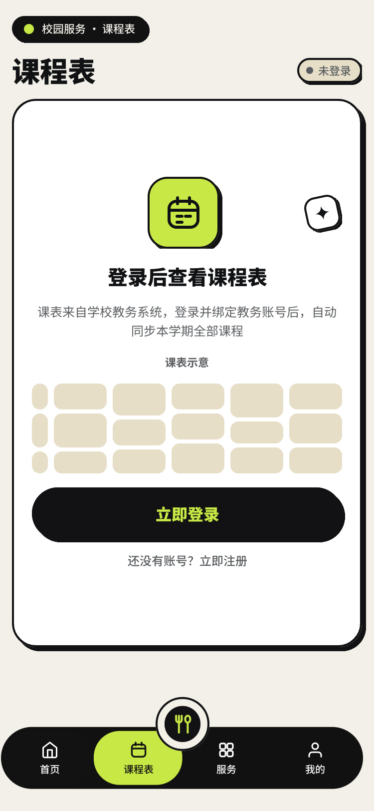<br><b>课程表 · 未登录</b><br><sub>未登录时不是空白页，<br>而是说明课表来源 + 给登录入口</sub></td>
<td align="center">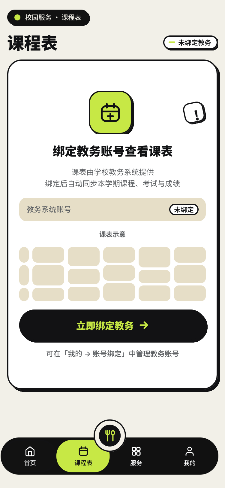<br><b>课程表 · 未绑定教务</b><br><sub>登录了但没绑教务账号，<br>文案直说「未绑定」并给出绑定入口</sub></td>
</tr>
</table>

### 通用状态规范

这是本项目比较特别的一块：把「空 / 加载中 / 出错」抽成**可复用的全局规范**，而不是每个页面各写一套。

三种状态刻意采用**不同的行动层级**——因为「结果为空」不是故障，不该催用户重试：

| 状态 | 按钮层级 | 理由 |
|---|---|---|
| 空态 | 次要行动（白底描边） | 结果为空是正常业务结果，不是错误 |
| 加载中 | **无任何可点击元素**，用骨架屏保留结构 | 避免用户重复触发 |
| 出错 | 主行动重试（墨黑胶囊 + 青柠字）+ 真实错误码 | 故障才需要引导重试，且必须给出可诊断的信息 |

<table>
<tr>
<td align="center">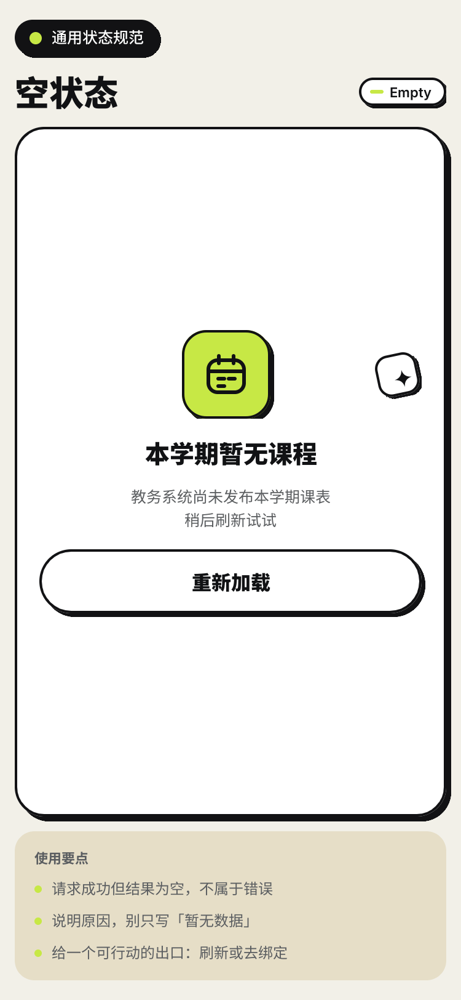<br><b>空态 Empty</b></td>
<td align="center">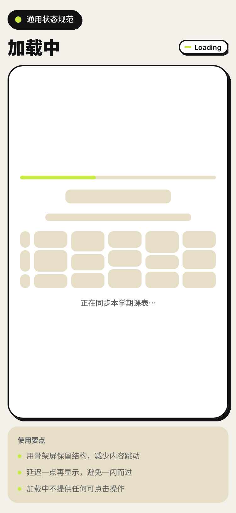<br><b>加载中 Loading</b></td>
<td align="center">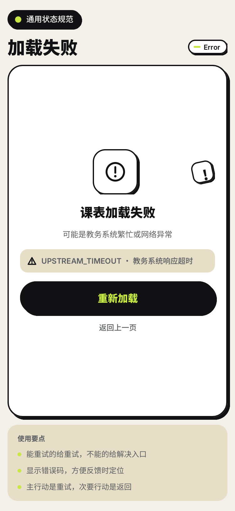<br><b>加载失败 Error</b></td>
</tr>
</table>

### 实现效果（真机渲染）

以下是代码实现后的实际渲染截图。**数据全部来自真实后端**，没有一条 mock。

<table>
<tr>
<td align="center">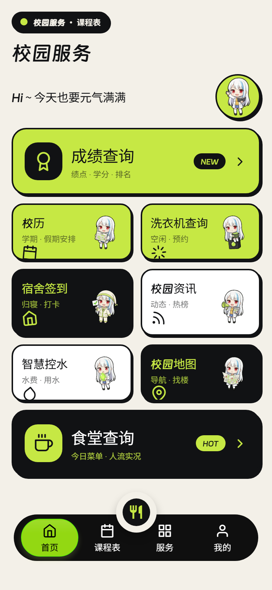<br><b>首页</b><br><sub>服务宫格，按真实可用性区分可点/待办</sub></td>
<td align="center">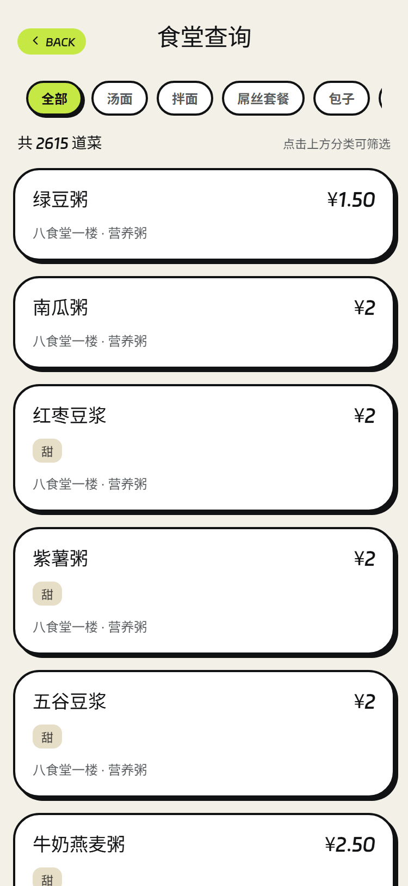<br><b>食堂查询</b><br><sub>真实菜品库，2600+ 道菜</sub></td>
</tr>
<tr>
<td align="center">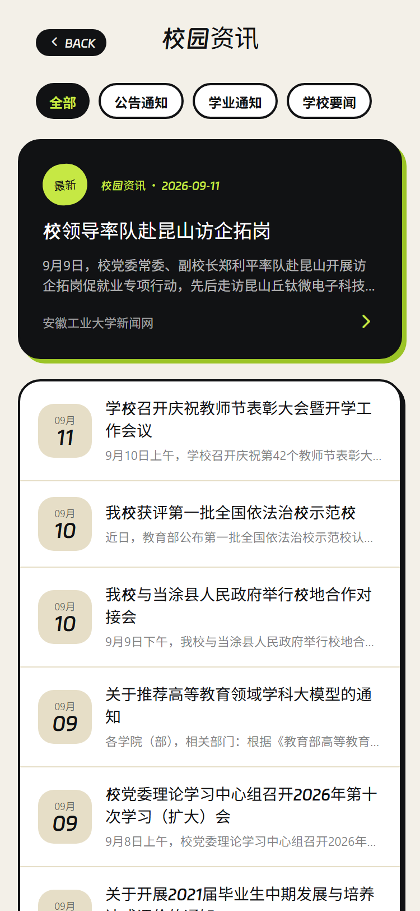<br><b>校园资讯</b><br><sub>对接学校新闻网</sub></td>
<td align="center">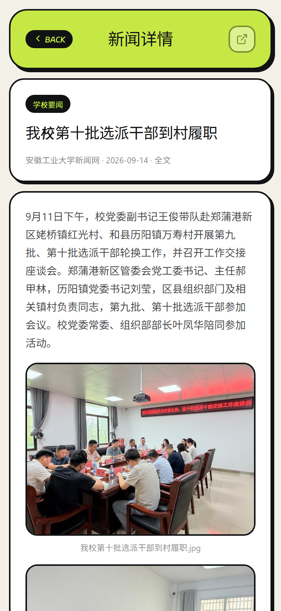<br><b>新闻详情</b><br><sub>正文全文渲染，含图片与格式</sub></td>
</tr>
<tr>
<td align="center">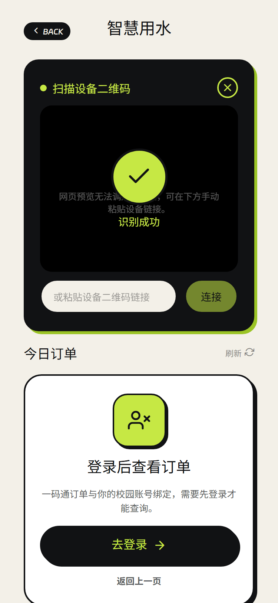<br><b>智慧用水 · 扫码</b><br><sub>翻转卡扫码，识别成功显示对号</sub></td>
<td align="center"><br><b>成绩查询</b><br><sub>绩点/学分统计，含未登录引导</sub></td>
</tr>
<tr>
<td align="center">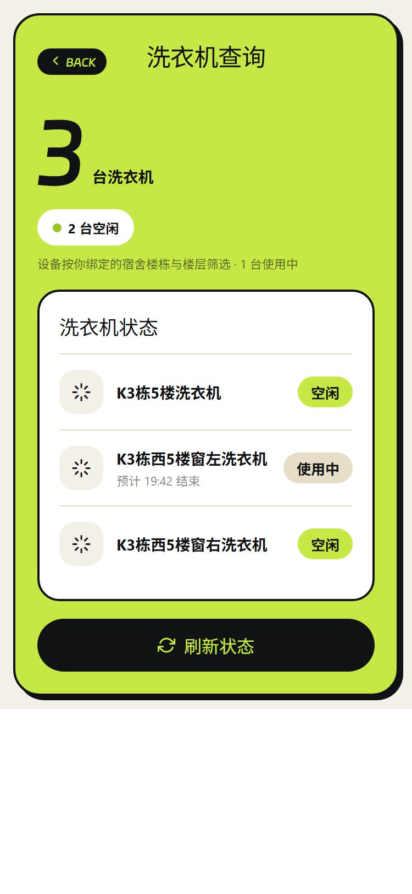<br><b>洗衣机查询</b><br><sub>按绑定宿舍楼栋过滤设备状态</sub></td>
<td></td>
</tr>
</table>

---

## 功能模块

| 模块 | 说明 |
|---|---|
| **课程表** | 从教务系统同步本学期课表，自动合并连续节次。支持未登录 / 未绑定 / 空 / 出错 / 就绪 五种状态 |
| **成绩查询** | 成绩、学分、绩点统计，适配教务系统的非数字成绩（如「优秀」「通过」） |
| **考试安排** | 考试时间来自教务表格原文，解析失败的归入「时间待定」并排在最后 |
| **电费充值** | 余额查询与充值，含二次确认、订单轮询；网络异常时明确提示「结果未知」而非重复提交 |
| **校园网** | 账户信息、在线设备（MAC 脱敏）、上网记录 |
| **宿舍签到** | 晚寝打卡、签到状态与历史记录；楼栋与房间号绑定 |
| **智慧用水** | 扫码连接设备后查询用水订单 |
| **食堂查询** | 菜品分类浏览、热评、对比（真实菜品库） |
| **洗衣机查询** | 按绑定宿舍过滤，显示空闲 / 使用中 |
| **校园资讯** | 学校新闻与通知，含正文全文渲染 |
| **校历 / 校园地图** | 学期安排、地标导航 |

---

## 技术栈

| 层 | 选型 |
|---|---|
| 框架 | Expo 57 · React Native 0.86 · React 19 |
| 路由 | Expo Router（文件路由） |
| 数据层 | TanStack Query |
| 安全存储 | expo-secure-store（令牌不落 AsyncStorage） |
| 相机 | expo-camera（扫码） |
| 动效 | React Native Animated + Reanimated |
| 语言 | TypeScript（strict） |

### 目录结构

```
app/          Expo Router 路由（仅路由文件）
page/         页面组件（19 个）
hooks/        数据与状态钩子（14 个）
api/
  contracts/  后端契约类型定义
  endpoints/  接口封装
lib/          纯函数工具（课表解析、成绩统计、HTML 解析等）
template/     贴纸风 UI 组件库
store/        全局状态
```

---

## 后端对接

对接真实校园服务后端 `https://ahut.domye.top`，覆盖 **60+ 个端点**，按模块划分：

| 模块 | 端点前缀 | 说明 |
|---|---|---|
| 用户 | `/user/*` | 登录、注册、资料、系统绑定、订阅任务 |
| 教务 | `/jwxt/*` | 课表、成绩、考试、教室、教材、培养方案 |
| 电费 | `/electricity/*` | 余额、充值订单 |
| 宿舍 | `/dorm/*` | 楼栋、绑定、签到、晚寝任务 |
| 校园网 | `/network/*` | 账户、设备、上网记录、上下线 |
| 智慧用水 | `/wise/*` | 扫码、订单、控制、支付 |
| 食堂 | `/canteen/*` | 分类、菜品、窗口、评论、对比 |
| 资讯 | `/news/*` | 列表、正文 |
| 其它 | `/calendar` `/campus-map/*` `/laundry` `/library/*` `/notification/*` | 校历、地图、洗衣机、图书馆、通知 |

### 一条贯穿项目的原则：不虚构接口

这个项目的做法是 **契约先于代码**：

- 每个字段、每个按钮、每个开关，都必须能指到具体后端路由与 DTO
- 后端没有的能力（如头像上传、第三方账号解绑），**一律不做**，或降级为只读展示
- 错误码取自后端定义（如 `NOT_BOUND` / `UPSTREAM_TIMEOUT`），不自造
- 接口实测验证，不依赖文档 —— 文档与实现不一致的地方，以实测为准

---

## 本地运行

```bash
npm install
npm start          # Expo 开发服务器，真机用 Expo Go 扫码
npm run web        # 浏览器预览
```

打包 Android Release APK：

```bash
cd android
./gradlew assembleRelease
# 产物：android/app/build/outputs/apk/release/app-release.apk
```

需要 JDK 17+ 与 Android SDK，并在 `android/local.properties` 指定 `sdk.dir`。

---

## 设计要点

- **贴纸潮流视觉**：奶油底 `#F3F0E8`、青柠 `#C6E844`、墨黑 `#111214`；2px 内描边 + 零模糊硬投影
- **状态即设计**：把中间态当作一等公民设计，而不是「加载失败就白屏」
- **文案说人话**：空态不写「暂无数据」，而是说明**为什么空** + 给一个可行动的出口
- **动画克制**：只动 `transform` 与 `opacity`，避免布局重排

---

## 许可

MIT
